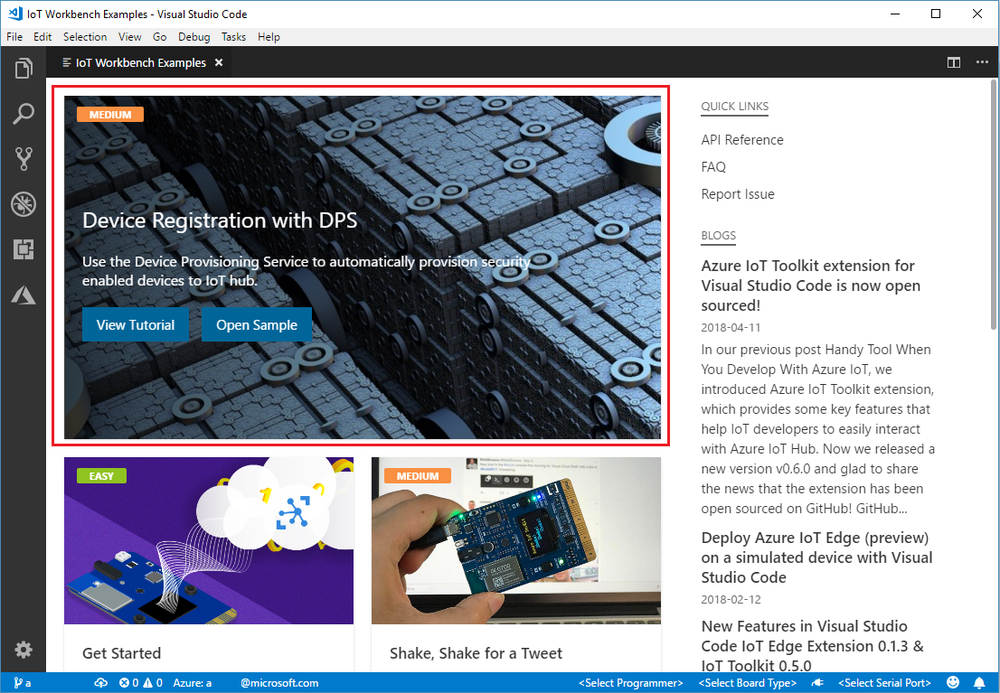
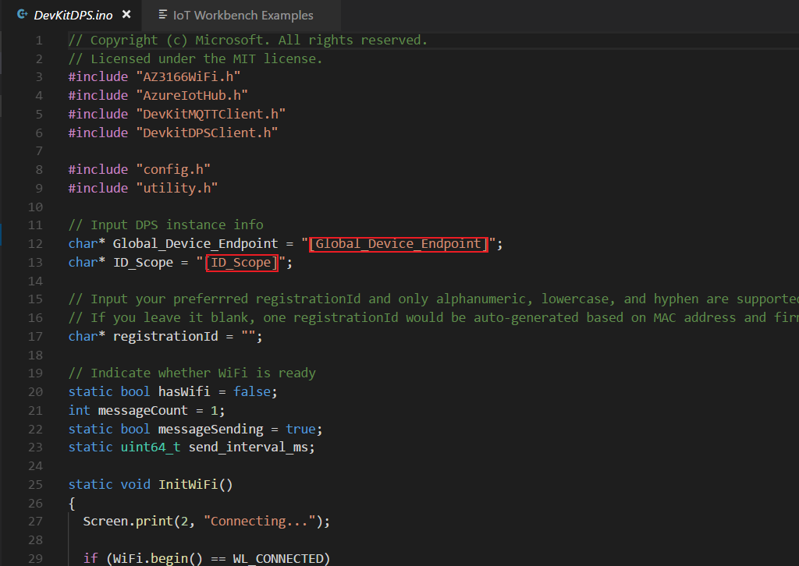
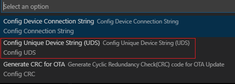
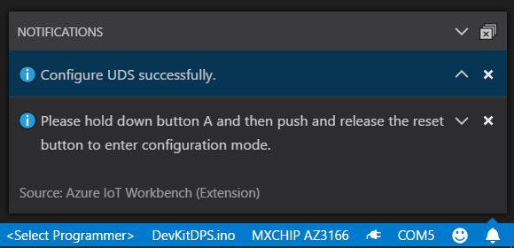
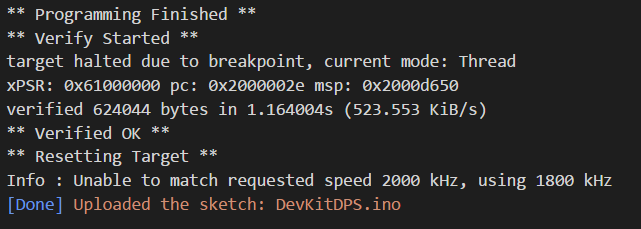
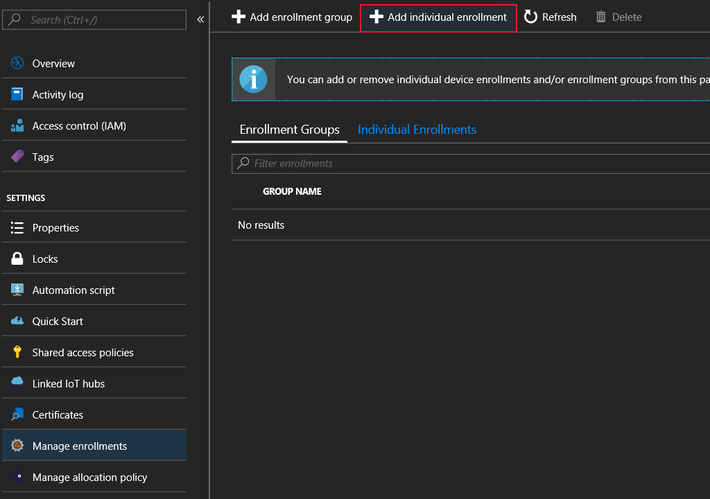
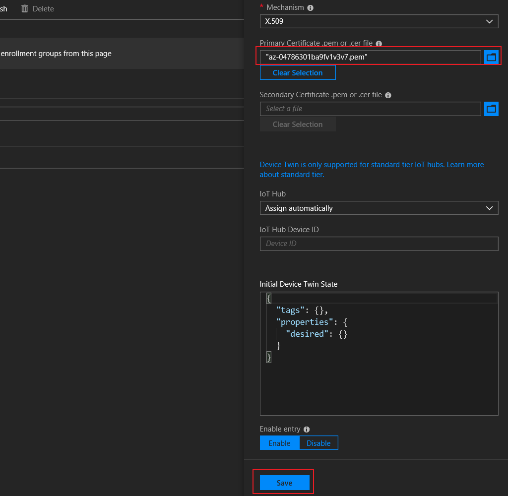
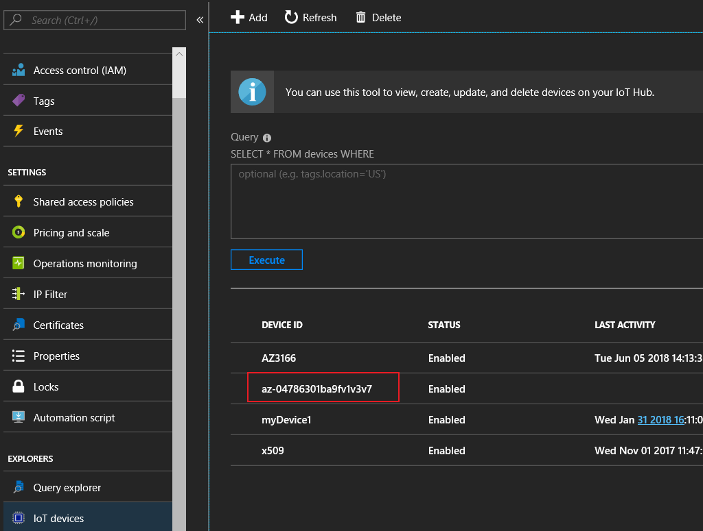

## Use Azure IoT Hub Device Provisioning Service auto-provisioning to register the MXChip IoT DevKit with IoT Hub

This article describes how to use Azure IoT Hub Device Provisioning Service [auto-provisioning](https://docs.microsoft.com/en-us/azure/iot-dps/concepts-auto-provisioning), to register the MXChip IoT DevKit with Azure IoT Hub. In this tutorial, you learn how to:

- Configure the global endpoint of the device provisioning service on a device.
- Use a unique device secret (UDS) to generate an X.509 certificate.
- Enroll an individual device.
- Verify that the device is registered.

The [MXChip IoT DevKit](https://aka.ms/iot-devkit) is an all-in-one Arduino-compatible board with rich peripherals and sensors. You can develop for it by using the [Visual Studio Code extension for Arduino](https://aka.ms/arduino). The DevKit comes with a growing [projects catalog](https://microsoft.github.io/azure-iot-developer-kit/docs/projects/) to guide your prototype Internet of Things (IoT) solutions that take advantage of Azure services.

## What you need

Finish the [Getting Started Guide](https://docs.microsoft.com/en-us/samples/azure-samples/mxchip-iot-devkit-get-started/sample/) to:

    * Have your IoT DevKit connected to Wi-Fi.
    * Prepare the development environment.

An active Azure subscription. If you do not have one, you can register via one of these methods:

    * Activate a [free 30-day trial Microsoft Azure account](https://azure.microsoft.com/free/).
    * If you are an MSDN or Visual Studio subscriber
    Claim your [Azure credit](https://azure.microsoft.com/pricing/member-offers/msdn-benefits-details/).

## Even if you have a subscription

Even if you do have an active Azure subscription but have not yet created an instance of the Device Provisioning service

    * Create and link IoT Hub with Device Provisioning Service instance with
    [Set up auto provisioning](https://docs.microsoft.com/en-us/azure/iot-dps/quick-setup-auto-provision).

## Open the project folder

### Start VS Code

    * Start Visual Studio Code.
    * Make sure [Azure IoT Device Workbench](https://marketplace.visualstudio.com/items?itemName=vsciot-vscode.vscode-iot-workbench) is installed.
    * Connect IoT DevKit to your PC.

### Open Azure IoT Device Workbench Examples

Use `F1` or`Ctrl+Shift+P` (macOS: `Cmd+Shift+P`) to open the command palette, type **Azure IoT Device Workbench**, and then select **Open Examples...**.

Select **IoT DevKit**.

Then the **IoT Device Workbench Example** window is shown up.

Find **DevKit DPS** and click **Open Sample** button. A new VS Code window with a project folder in it opens.

### Update the Global Device Endpoint and ID Scope in device code

1. In the Azure portal, go to your DPS instance, select the **Overview** blade for your Device Provisioning Service and note down the **Global device endpoint** and **ID Scope** value.
    

2. Open **DevKitDPS.ino**, Find and replace `[Global Device Endpoint]` and `[ID Scope]` with the values you just note down.
    

## Save Unique Device Secret on STSAFE security chip

Device Provisioning Service can be configured on device based on its [Hardware Security Module (HSM)](https://azure.microsoft.com/en-us/blog/azure-iot-supports-new-security-hardware-to-strengthen-iot-security/). DevKit uses [Device Identity Composition Engine (DICE)](https://trustedcomputinggroup.org/wp-content/uploads/Foundational-Trust-for-IOT-and-Resource-Constrained-Devices.pdf) from the [Trusted Computing Group (TCG)](https://trustedcomputinggroup.org). A **Unique Device Secret (UDS)** saved in STSAFE security chip on the DevKit is used to generate the device unique [X.509](https://docs.microsoft.com/en-us/azure/iot-dps/tutorial-set-up-device#select-a-hardware-security-module) certificate. The certificate can be later used for the enrollment process in the Device Provisioning Service.

A typical **Unique Device Secret (UDS)** is a 64 characters long hexadecimal digit.

1. Open the command palette and select **Azure IoT Device Workbench: Configure Device Settings...**.

    

2. Select **Config Unique Device String (UDS)**.

    

3. Note down the generated uds string and then press enter.

    

Here you may need to close [serial monitor](https://github.com/microsoft/vscode-iot-workbench/blob/master/docs/iot-devkit/devkit-get-started.md/#Serial_monitor_usage) and let devkit enter configuration mode. After UDS string configed successfully, you will see a Visual Studio Code notification.

## Build and upload the device code

1. Open **DevKitDPS.ino** and find **registrationId**, give a new value. 

   The Registration ID has to use alphanumeric, lowercase, and hyphen combinations only with maximum 128 characters long. See [Manage device enrollments with Azure portal](https://docs.microsoft.com/en-us/azure/iot-dps/how-to-manage-enrollments) for more details.

   > You can leave the **registrationId** as blank, the application will generate one for you based on the MAC address and firmware version. If you want to customized it, 

2. Open the command palette and select **Azure IoT Device Workbench: Upload Device Code**. 
   

3. VS Code then starts verifying and uploading the code to your DevKit.
   

4. The DevKit reboots and starts running the code.

5. If you  leave the **registrationId** as blank, please note down **DevKit MAC Address** and **DevKit Firmware Version** value from serial monitor.
   

## Generate X.509 certificate

Open integrated terminal in Visual Studio Code and run **dps_cert_gen in tool folder**. Input information just noted down.

1. Specified the **registrationId**

   

2. Not specified the **registrationId**

   

And you will see a **.pem** file generated in your folder.

**Note:** Here we input **.build\DevKitDPS** when program ask for project name. Then the program will find compiled file with path **.build\DevKitDPS.ino.bin** and **.build\DevKitDPS.ino.elf**. Output compiled binary file to **.build** path is our default setting. If you changed build path or .ino file name before, you will need to provide a path to your compiled output file.

## Create a device enrollment entry in the Device Provisioning Service

1. In the Azure portal, navigate to your provisioning service. Click **Manage enrollments**, and select the **Add individual enrollments** tab.
    

2. Upload the **.pem** certificate you just have.

3. Leave the rest as default and click **Save**.
    

## Start the DevKit

1. Launch VS Code and open [serial monitor](https://github.com/microsoft/vscode-iot-workbench/blob/master/docs/iot-devkit/devkit-get-started.md/#Serial_monitor_usage).

2. Press the **Reset** button on your DevKit.

You should see the DevKit start the registration with your Device Provisioning Service and **DPS connected!** on DevKit Screen.

## Verify the DevKit is registered on IoT Hub

Once your device boots, the following actions should take place:

1. The device sends a registration request to your Device Provisioning Service.
2. The Device Provisioning Service sends back a registration challenge to which your device responds.
3. On successful registration, the Device Provisioning Service sends the IoT hub URI, device ID and the encrypted key back to the device.
4. The IoT Hub client application on the device then connects to your hub.
5. On successful connection to the hub, you should see the device appear in the IoT hub's Device Explorer.
    

## Problems and feedback

If you encounter problems, refer to [FAQs](https://microsoft.github.io/azure-iot-developer-kit/docs/faq/) or reach out to us from the following channels:

- [Gitter.im](http://gitter.im/Microsoft/azure-iot-developer-kit)
- [Stackoverflow](https://stackoverflow.com/questions/tagged/iot-devkit)

## Next Steps

Now that you have learned prepare the DevKit to enroll a device securely to DPS using DICE, so that it will automatically register to IoT Hub with zero-touch.

Advance to the other tutorials to learn:

- [Create and provision a simulated device](https://docs.microsoft.com/en-us/azure/iot-dps/quick-create-simulated-device)
- [Manage device enrollments](https://docs.microsoft.com/en-us/azure/iot-dps/how-to-manage-enrollments)
- [Revoke device access](https://docs.microsoft.com/en-us/azure/iot-dps/how-to-revoke-device-access-portal)
- [Use HSM with SDK](https://docs.microsoft.com/en-us/azure/iot-dps/how-to-revoke-device-access-portal)
- [Control access to Provisioning Service](https://docs.microsoft.com/en-us/azure/iot-dps/how-to-control-access)